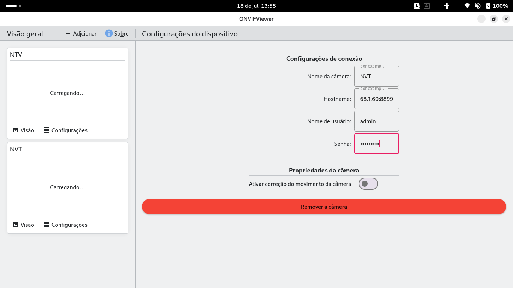
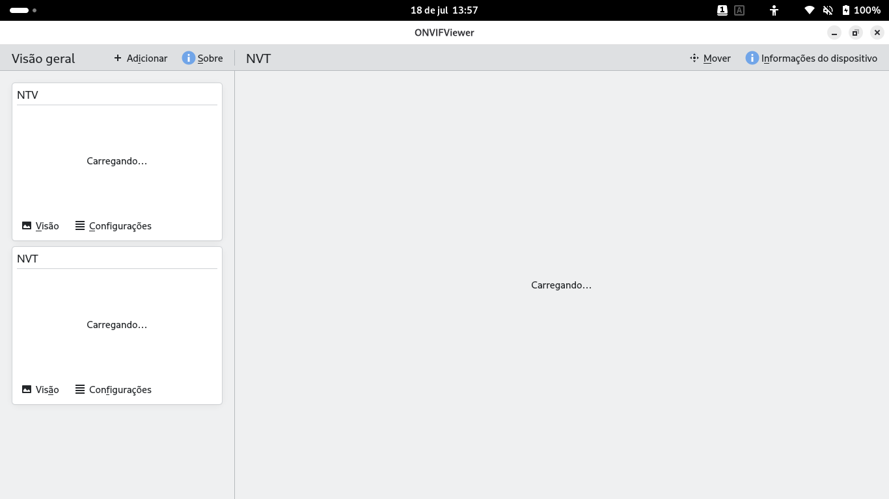
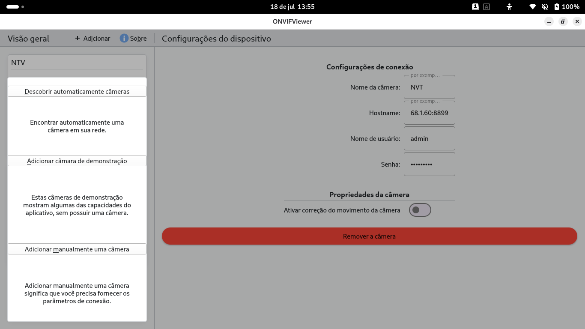

<!--
SPDX-License-Identifier: GPL-3.0-or-later
-->

# Problemas conhecidos

Problemas observados ao executar a versão portada para Qt6/KF6.

## 1. A imagem da câmera não carrega (fica em "Carregando…")

Os cards da visão geral ficam presos em **"Carregando…"** e a miniatura/snapshot
da câmera nunca aparece.



Na tela de visualização da câmera o mesmo acontece: a área principal fica em
**"Carregando…"** e o vídeo/imagem não é exibido.



**Sintoma:** nem o snapshot nem o stream ficam disponíveis, então o app mostra
o texto "Carregando…" indefinidamente (ver `OnvifCameraViewer.qml`).

**Possíveis causas a investigar:**
- A câmera não está acessível / credenciais ou hostname incorretos.
  (O hostname `68.1.60:8899` que aparecia nas capturas **não** era um host
  inválido: o campo da tela de configurações estava estreito demais e cortava
  a exibição do IP. Isso foi corrigido — ver seção "Tela de configurações"
  abaixo.)
- Falha ao baixar o snapshot (`OnvifSnapshotDownloader`) — verificar se o
  `QPixmap` está sendo preenchido corretamente no Qt6.
- Formato/codec do stream não suportado pelo backend FFmpeg do QtMultimedia 6.

## Stream não carregava: XML inválido no GetStreamUri (corrigido)

Algumas câmeras (firmware baseado em XiongMai/XM, porta 8899) devolvem a URL
RTSP com um `&` **não-escapado** dentro do XML da resposta do `GetStreamUri`:

```xml
<tt:Uri>rtsp://.../stream=0&protocol=unicast.sdp?real_stream</tt:Uri>
```

Em XML `&` tem que ser `&amp;`, então o parser estrito do KDSoap rejeita a
resposta inteira. O erro observado:

```
getStreamUriError: Fault 3: XML error: [1:1773] Esperado ';', mas obteve '='.
```

Sem o `streamUri`, o vídeo nunca carregava. O KDSoap 2.2 não expõe hook para
sanear a resposta, então, quando o `GetStreamUri` falha, refazemos a requisição
por conta própria (`OnvifDeviceConnectionPrivate::fetchUriWithLeniency`),
escapamos os `&` soltos e extraímos o elemento `Uri` com um parser tolerante.
Só se isso também falhar é que o erro original é reportado. Ver
`libOnvifConnect/onvifdeviceconnection.cpp`, `onvifmedia2service.cpp` e
`onvifmediaservice.cpp`. Verificado contra uma câmera real (Media2): o RTSP
h264 1080p passou a ser recuperado e reproduzido.

## Snapshot não carregava: porta errada + espaço no URI (corrigido)

Dois problemas independentes impediam o download do snapshot desta câmera:

1. **Porta sobrescrita.** O snapshot é servido pelo webserver da câmera na
   **porta 80** (`http://.../webcapture.jpg`), enquanto o ONVIF fica na 8899.
   O `updateUrlHost` reescrevia o host (bom, corrige o IP interno reportado)
   mas **também forçava a porta ONVIF (8899)**, quebrando a URL. Agora ele
   reescreve só o host e **preserva a porta** do serviço.
2. **Espaço no final do URI.** A câmera devolve o URI do snapshot com um espaço
   à direita (`...password=8r4tQXWi `). Enviado no request, o webserver fecha a
   conexão (`RemoteHostClosedError`). Agora aplicamos `.trimmed()` ao URI do
   snapshot e do stream ao construí-lo.

Ver `libOnvifConnect/onvifdeviceconnection.cpp` (updateUrlHost),
`onvifmedia2service.cpp` e `onvifmediaservice.cpp`. Verificado: o snapshot
640x360 passou a baixar e aparecer no card da visão geral.

## Tela de configurações: campos estreitos cortavam o IP (corrigido)

No layout desktop (modo largo do `Kirigami.FormLayout`, com os rótulos ao lado
dos campos), os `TextField` ficavam na largura implícita (~200 px) encostados à
direita, com um vão vazio à esquerda. Hostnames longos como
`192.168.1.60:8899` eram cortados na exibição.

`Layout.fillWidth: true` **não** resolve sozinho: em modo largo o FormLayout
centraliza o bloco e ignora o `fillWidth` (todos os campos compartilham a
largura da coluna = a maior largura implícita). A correção foi adicionar
`Layout.preferredWidth: Kirigami.Units.gridUnit * 20` a cada campo (mantendo o
`fillWidth`, que passa a preencher a largura no modo estreito/mobile). Ver
`src/DeviceSettingsPage.qml`.

## 2. Menu "Adicionar" / descoberta automática

Menu de adicionar câmera, com as opções "Descobrir automaticamente câmeras",
"Adicionar câmara de demonstração" e "Adicionar manualmente uma câmera".



> _Descreva aqui o problema específico desta tela (ex.: a descoberta não
> encontra nenhuma câmera na rede, ou outro comportamento inesperado)._

## Avisos no console (não impedem o uso)

Durante a execução aparecem alguns avisos que **não** quebram o aplicativo:

- `depends on non-NOTIFYable properties: OnvifDevice::isPanTiltSupported /
  isPtzHomeSupported / isZoomSupported` — as propriedades de capacidade PTZ não
  têm sinal `NOTIFY`.
- `ToolButton: Layout: column (3) should be less than the number of columns (3)`
  — índice de coluna fora do intervalo no `GridLayout` do PTZ.
- `OverlaySheet: Binding loop detected for property "implicitHeight"` — laço de
  binding no dimensionamento dos overlays no Kirigami 6.
- `Created graphical object was not placed in the graphics scene` — inofensivo.
